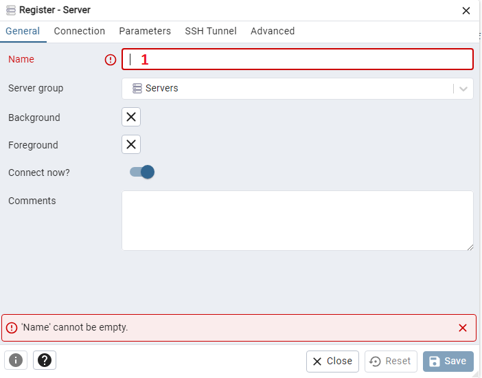
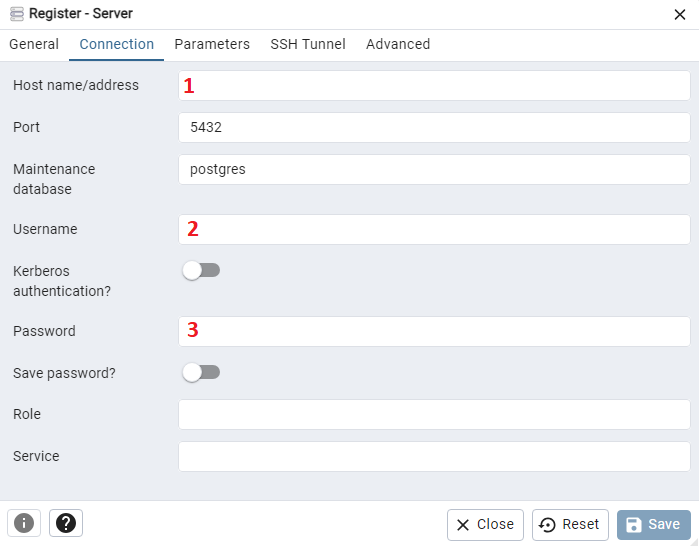
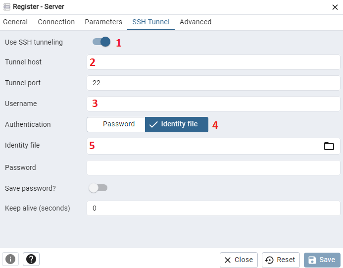
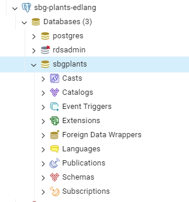

=======================
Connecting with PGAdmin
=======================

In order to connect to the database with PG Admin contact Evan Lang to recieve a database username and password, the connection parameters, and an SSH Key.

This is for admins who want to interact with the database via SQL.

Connecting
==========

Open PGAdmin, right click "Server" in the top left corner, select "Register" and then "Server"

1.  Input a name, this is a display name for the server and can be anything you want.

1. Input the database endpoint for host name/address

2. Input your databse username

3. Input your database password

1. Enable SSH tunneling

2. Input the tunnel host, this is the AWS EC2 Public IP (ec2-x-x-x-x.us-west-2.compute.amazonaws.com)

3. Input ubuntu as the username

4. Select Identity File

5. Attach the SSH key you have been provided

Now save the server! If you are successful the database should show up under the "Servers" dropdown in the top left corner.

